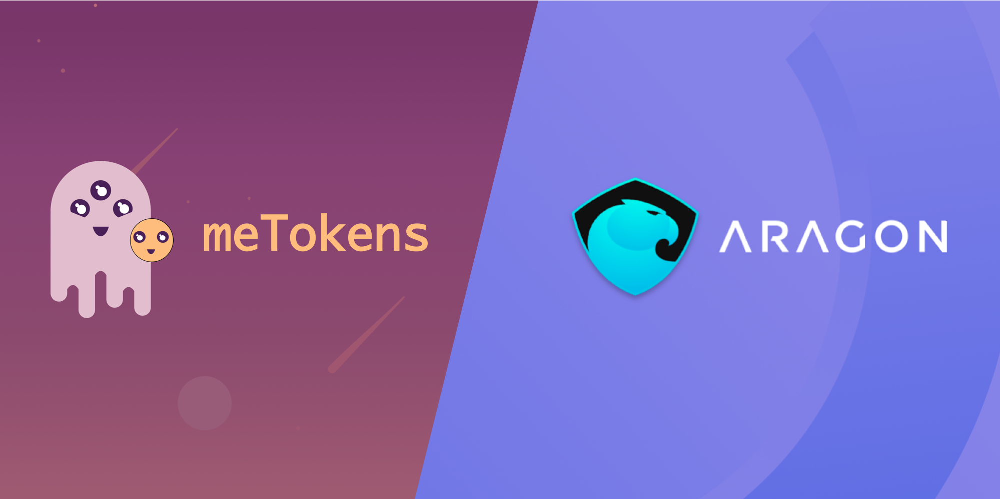
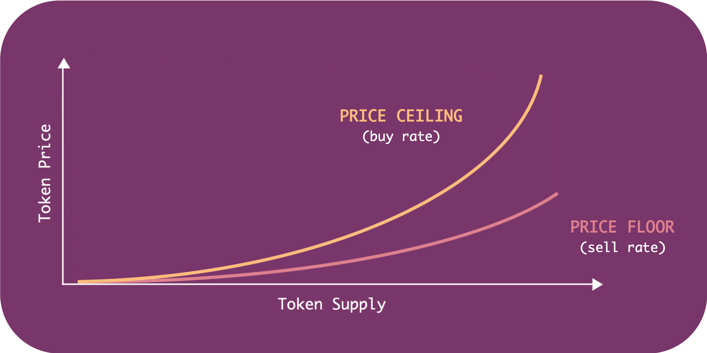

# Synthetic Labor is now available for Aragon DAOs with meTokens

*meToken is a new primitive that allows Aragon DAOs to create thier own currency, which we call “Synthetic Labor.” An Aragon DAO’s meToken can be used to pay for DAO services by external community members, and it can be used as a speculative financial vehicle for investors. meTokens are designed to create new revenue streams for Aragon DAOs and to assist them in discovering market-fit for their operations.*

## Coordination with Aragon

[Aragon](https://aragon.org/) is one of the [most popular DAO frameworks](https://poweredby.aragon.org/) in the Ethereum ecosystem today. Its tools are designed to empower individuals with the ability to [self-organize in unstoppable ways](https://blog.aragon.org/the-aragon-manifesto-4a21212eac03/_). Most of the applications currently available to Aragon users are built to assist members with internal coordination, [including voting, budgeting, and payroll](https://mainnet.aragon.org/#/governance.aragonproject.eth_.

While internal coordination is immensely useful for DAOs to be able to push value out into the world, it’s not as particularly useful in coordinating with external actors who wish to pull value from the members directly. That is to say, DAOs do not yet have an incentivized way of responding to “pull requests” from individuals or other DAOs outside the organization.

meToken is a new app available to Aragon DAOs that is designed to solve this gap in external coordination.

## Introducing meTokens to Aragon DAOs

Just as other Ethereum-based projects, such as [MakerDAO](https://makerdao.com/), have successfully synthesized new digital assets, like their [DAI Stablecoin](https://developer.makerdao.com/dai/1/), meTokens have emerged to create a comparably novel crypto-economic construction, called Synthetic Labor.

Synthetic Labor is a type of collateralized token that is tethered directly to an individual or group of individuals and can be spent only with its owner as a form of payment. A meToken can, therefore, be set to be owned by a DAO. And anyone who holds the meToken are then able hire members of the DAO for specific tasks using their meToken as payment.

When an Aragon DAO opts into using meTokens, it provides members with opportunities to generate revenue and quickly discover market fit for their operations. If, for example, an Aragon DAO is built for a guild of wallet builders, then community members may begin accumulating the DAO’s meToken as a way to purchase desirable new features, such as local [zero-knowledge transaction](https://z.cash/technology/zksnarks/) integrations with [Tornado Cash](https://tornado.cash/).

If the integration is successful, then said community members may continue to hold a portion of the DAO’s meToken as an investment. The successful integration request might signal to a larger community of wallet users that the Wallet DAO’s ability to ship new features are far above anyone else’s. This may then attract more people to purchase the Aragon-based Wallet DAO’s meToken to request new features of their own. All the while, holders of the meToken may benefit from appreciation in the value of the meToken.

## How Exactly Do meTokens Work?

meTokens are minted along a bonding curve. Bonding curves are unique in that they reward spenders and speculators who buy meTokens early. The earlier you buy, the more leverage you have to either spend the meToken with additional buying power or sell the meToken for a profit.

Individuals buy meTokens directly from the [bonding curve](https://medium.com/linum-labs/intro-to-bonding-curves-and-shapes-bf326bc4e11a) at the buy rate by depositing collateral into the curve. As more people buy from the curve, new meTokens are minted — the total supply increases — and the price appreciates. The growth of supply and price are fixed to a preset rate (this is the “curve”).

If community members wish to spend their meToken, the owner — in this case the Aragon DAO — can receive them as payment, burn them, and unlock the underlying collateral.

If community members instead wish to sell their meToken (potentially for a profit), they can opt to either sell meTokens on a secondary market, such as [Uniswap](https://uniswap.exchange/swap), or sell the meTokens back to the bonding curve at the sell rate. When meTokens are sold back to the bonding curve, meTokens are removed from circulation, and a certain amount of collateral is left behind.

The difference in value between the floor and the ceiling of the bonding curve represents the collateral left behind by sellers (aka “speculators”). The “left behind” collateral remains available for only individuals who actually spend the meToken with its owner. In this sense, speculators actually help subsidize and stabilize the value of meTokens for spenders.

## Closing Considerations

meTokens are now live on Ethereum mainnet at [StakeOnMe.com](http://stakeonme.com/). This means Aragon DAOs today can begin implementing their own meTokens. Interested individuals and DAOs are invited to reach out to the meToken team on our [Discord](https://discord.gg/qpRSjnd) to ask questions, gain a better [understanding of the system](https://stakeonme.com/About), and to learn some of the [game theory behind this new primitive](https://drive.google.com/file/d/1QfZyitdYTzyv4PIPStwL5si00jmguWm2/view).

Once you create your meToken, be sure to use promote yourself with the hashtag #StakeOnMe. You can also set up your own ENS subdomain natively through our application so people can buy your meTokens simply by sending it ETH — example: StakeOnMe.WalletDAO.eth. Enjoy & happy staking!

- 🥩 meTokens are now live at [StakeOnMe.com](http://stakeonme.com/)
- 💳 Create [your own meTokens](https://stakeonme.com/Tokenize)
- 🔍 Discover and [purchase the meTokens of other individuals & DAOs](https://stakeonme.com/Explore)
- 🐦 Follow us on Twitter [@meTokens](https://twitter.com/metokens)
- 👾 Chat with us on [Discord](https://discord.gg/qpRSjnd)
- 📓 And when we're not [censored on Medium](https://twitter.com/evan_van_ness/status/1252012688420614144), you can [find us there](https://medium.com/metokens), too
